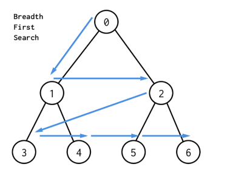

# 103. [Binary Tree Zigzag Level Order Traversal](https://leetcode.com/problems/binary-tree-zigzag-level-order-traversal/)

## Question:

Given the root of a binary tree, return the zigzag level order traversal of its nodes' values. (i.e., from left to right, then right to left for the next level and alternate between).

Example 1:
```go
Input: root = [3,9,20,null,null,15,7]
Output: [[3],[20,9],[15,7]]
```
Example 2:
```go
Input: root = [1]
Output: [[1]]
```
Example 3:
```go
Input: root = []
Output: []
```

Constraints:
```
The number of nodes in the tree is in the range [0, 2000].
-100 <= Node.val <= 100
```

## 大意
給定一個二元樹，請以z字型的方式回傳每層的元素。


## 解題思路
利用bfs 來把每一層都抓出來 並且找一個response append 進去

